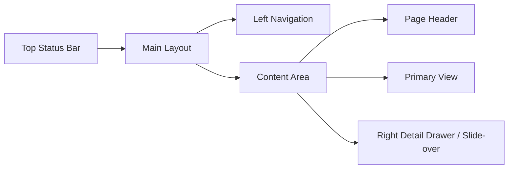
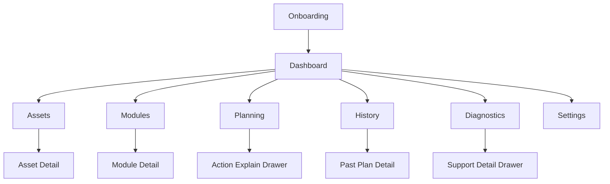

# HEMS UI Wireframes

This note expands the HEMS change with concrete UI structure, screen responsibilities, and frontend stack choices. It is a design aid for implementation and should stay aligned with `design.md`, `proposal.md`, and the capability specs.

## Frontend Stack

Recommended frontend stack:
- React
- TypeScript
- Vite
- Tailwind CSS
- shadcn/ui
- TanStack Router
- TanStack Query
- React Hook Form
- Zod
- Recharts via shadcn chart wrappers
- Lucide icons

Why this stack:
- strong fit for dashboard and control-panel UIs
- good primitives for forms, drawers, tables, dialogs, tabs, and command palettes
- easy to keep visual language custom instead of default-framework looking
- good enough chart support for timelines, forecasts, and decision history
- fast local iteration inside an add-on repo

Recommended additions later if needed:
- Zustand only if local UI state becomes noisy
- date-fns for timeline formatting
- react-resizable-panels for split planning and explain views

## Frontend Architecture

Suggested frontend folder shape:

```text
frontend/
  src/
    app/
      router.tsx
      providers.tsx
      layouts/
    components/
      app-shell/
      status/
      assets/
      modules/
      planning/
      diagnostics/
      history/
      forms/
      charts/
    features/
      onboarding/
      dashboard/
      assets/
      modules/
      planning/
      history/
      diagnostics/
      settings/
    lib/
      api/
      formatters/
      constants/
      ui/
    hooks/
    types/
```

Guidelines:
- shared layout and reusable primitives in `components/`
- route-owned composition and page logic in `features/`
- no backend response shaping inside visual leaf components
- central API client and query keys in `lib/api/`

## Route Tree

Recommended route tree:

```text
/
  /onboarding
  /dashboard
  /assets
  /assets/:assetId
  /modules
  /modules/:moduleId
  /planning
  /history
  /history/:planId
  /diagnostics
  /settings
```

Route behavior:
- `/` redirects to `/onboarding` when installation is incomplete
- `/` redirects to `/dashboard` when installation is ready
- detail drawers should be URL-addressable later, but v0.1 can keep them local UI state

Route guards:
- block access to normal routes when backend bootstrap has not completed
- allow read-only viewing of most routes when system is degraded, but disable unsafe actions

## App Shell Contract

`AppShell` responsibilities:
- mount router outlet
- fetch top-level system summary
- manage left navigation state
- control right-side explain or detail drawer host
- render empty, loading, degraded, and ready chrome consistently

Top bar component contract:

```ts
type TopBarSummary = {
  mode: "disabled" | "observe" | "dry_run" | "advisory" | "auto"
  health: "healthy" | "degraded" | "error"
  warningCount: number
  lastPlanAt?: string
  paused: boolean
}
```

Left navigation rules:
- active route clearly highlighted
- show warning dot on sections with actionable issues
- collapse to icons only on medium widths if needed
- mobile uses sheet drawer

Right drawer rules:
- one drawer host for explain, diagnostics detail, and history detail patterns
- drawer width should support dense technical content on desktop
- drawer becomes full-screen on mobile

## Visual Direction

Product direction:
- dark-first operational dashboard
- high information density without feeling cramped
- strong state colors used sparingly
- clear distinction between selected, blocked, deferred, and degraded states

Color roles:
- base background: near-black or charcoal
- panel background: slightly lifted neutral
- primary accent: energy orange
- success/selected action: green
- info/neutral plan state: blue
- warning/degraded: amber
- blocked/error: red

Typography direction:
- clear sans-serif for body and UI controls
- slightly technical feel without looking like a developer tool
- headings compact, not oversized

## App Shell



Top status bar:
- current system mode
- system health
- warning count
- last plan timestamp
- quick refresh
- global pause

Left navigation:
- Dashboard
- Assets
- Modules
- Planning
- History
- Diagnostics
- Settings

Global interaction patterns:
- detail drawer for inspect and explain flows
- modal only for destructive confirmations or setup completion
- tabs inside workspaces, not in global navigation

## Screen Map



## 1. Onboarding

Goal:
- get from empty install to first dry-run plan fast

Steps:
1. Welcome
2. HA connectivity check
3. Discover entities
4. Select assets
5. Map required entities
6. Validate capabilities
7. Enable first module
8. Confirm dry-run mode
9. Go to dashboard

Wireframe:

```text
+--------------------------------------------------------------+
| HEMS Setup                                        Step 3 of 8 |
+--------------------------------------------------------------+
| Left: progress                                           Help |
|  - Connect HA                                                |
|  - Discover entities                                         |
|  - Select assets                                             |
|  - Map battery                                                |
|  - Validate                                                   |
|  - Enable module                                              |
|                                                               |
| Right: current step                                           |
|  [ Search entities................................. ]         |
|                                                               |
|  Suggested battery entities                                   |
|  [x] sensor.battery_soc                Ready                  |
|  [x] sensor.battery_power              Ready                  |
|  [ ] select.battery_mode               Missing                |
|                                                               |
|  Required mappings                                              |
|  - SOC                           [ entity picker v ]          |
|  - Power                         [ entity picker v ]          |
|  - Mode control                  [ entity picker v ]          |
|                                                               |
|  [Back]                                      [Next]           |
+--------------------------------------------------------------+
```

UX notes:
- wizard should be resumable
- setup can finish with warnings, but not with missing blocking requirements for the first chosen module
- show current entity values inline where possible

Route:
- `/onboarding`

Page sections:
- setup progress rail
- step body
- side help panel on desktop
- sticky footer actions

Step contract:

```ts
type OnboardingStep = {
  id: string
  title: string
  description: string
  status: "pending" | "active" | "done" | "blocked"
  isRequired: boolean
}
```

Primary actions:
- next
- back
- save and exit
- retry connectivity
- refresh discovery

Validation states:
- pristine
- validating
- valid
- warning
- blocked

Important fields by step:
- connectivity: HA reachability, token validity, latency
- asset selection: asset types to enable in this install
- entity mapping: required capabilities first, optional capabilities second
- first module: module enabled state, linked asset readiness

Empty and edge states:
- no entities discovered
- HA unavailable
- partial battery mapping found automatically
- user skips optional assets

Success exit condition:
- at least one enabled module with at least one ready asset
- global mode confirmed as `dry_run`

## 2. Dashboard

Goal:
- answer what is happening now, what happens next, and why

Sections:
- system summary row
- current decision card
- energy flow summary
- next 24h plan summary
- active assets and modules
- warnings and blockers

Wireframe:

```text
+-----------------------------------------------------------------------------------+
| Mode: Dry Run | Health: Healthy | Warnings: 2 | Last Plan: 12:43 | Pause | Refresh |
+----------------------+----------------------+--------------------+----------------+
| Current Decision     | Energy Flow          | Next Action        | Warnings       |
| Charge battery       | Grid: import 1.8kW   | 13:00 charge       | Battery mode   |
| Because price is low | Solar: 0.6kW         | 45 min             | mapping stale  |
| and reserve is low   | Battery: idle        | Why ->             | View all ->    |
+----------------------+----------------------+--------------------+----------------+
| Next 24h Timeline                                                              |
| [ now ][ forecast line ][ selected blocks ][ blocked markers ]                 |
+--------------------------------------------------------------------------------+
| Assets Summary                         | Modules Summary                        |
| Battery: ready / dry run               | Battery module: enabled                |
| Solar: partial                         | Water heater: disabled                 |
| Grid: ready                            | EV: disabled                           |
+--------------------------------------------------------------------------------+
```

Key actions:
- open explain drawer from current decision
- jump to blocked asset or diagnostics
- switch mode
- refresh planning

Route:
- `/dashboard`

Page composition:
- page header
- summary KPI strip
- current decision card row
- main planning overview panel
- assets and modules summary row
- warning stack

Dashboard card priority:
1. current decision
2. warnings that block trust or setup
3. next action
4. plan timeline
5. asset and module summaries

Required widgets:
- `ModeHealthStrip`
- `CurrentDecisionCard`
- `EnergyFlowCard`
- `NextActionCard`
- `WarningListCard`
- `PlanTimelineCard`
- `AssetSummaryCard`
- `ModuleSummaryCard`

Data contract sketch:

```ts
type DashboardSummary = {
  currentDecision?: FinalActionSummary
  nextAction?: FinalActionSummary
  warnings: WarningItem[]
  assets: AssetSummary[]
  modules: ModuleSummary[]
  timeline: TimelineItem[]
  energySnapshot?: EnergySnapshot
}
```

Dashboard states:
- first-run incomplete
- healthy with active plan
- healthy with no valid plan
- degraded because source data is stale
- paused by user

CTA rules:
- every blocker must link to a fix path
- every selected action must link to explain view
- if there is no plan, the main CTA is `Fix Setup` or `Run Validation`, not refresh spam

## 3. Assets

Goal:
- configure devices and verify they are usable

Assets list view:

```text
+--------------------------------------------------------------------------------+
| Assets                                                             + Add Asset |
+--------------------------------------------------------------------------------+
| Name            Type      Mode      Validation   Warnings   Last Update        |
| Home Battery    Battery   Dry Run   Ready        0          12:43              |
| Solar Roof      Solar     Observe   Partial      1          12:42              |
| Grid Meter      Grid      Dry Run   Ready        0          12:43              |
+--------------------------------------------------------------------------------+
| Filter: [All v]  Search: [.......................]                             |
+--------------------------------------------------------------------------------+
```

Asset detail workspace:

```text
+--------------------------------------------------------------------------------+
| Home Battery                                                   Ready | Dry Run |
+--------------------------------------------------------------------------------+
| Tabs: [Overview] [Entity Mapping] [Capabilities] [Constraints] [Diagnostics]   |
+--------------------------------------------------------------------------------+
| Overview                                                                        |
| Asset type: Battery                                                             |
| Linked module(s): Battery                                                       |
| Last valid plan input: 12:43                                                    |
| Quick actions: [Validate] [Disable Asset] [Open Explain Inputs]                |
+--------------------------------------------------------------------------------+
```

Entity Mapping tab:
- grouped by required and optional
- entity picker
- current value preview
- domain badge and freshness indicator

Capabilities tab:
- capability matrix
- ready / missing / degraded states
- why capability matters

Constraints tab:
- min SOC
- max SOC
- charge and discharge limits
- cooldowns later if needed
- advanced section hidden by default

Diagnostics tab:
- last validation run
- stale entities
- parsing issues
- raw mapped entity snapshots

Routes:
- `/assets`
- `/assets/:assetId`

Assets list features:
- search by asset name and entity id
- filter by type
- filter by validation state
- filter by operating mode
- quick add asset button

Asset list row actions:
- open detail
- validate asset
- duplicate asset later
- disable asset
- delete asset with confirmation

Asset detail layout contract:
- left column for summary and quick actions
- main column for active tab content
- optional right rail for capability help or live entity preview on wide screens

Asset overview content:
- asset identity
- operating mode
- readiness status
- linked modules
- last valid input time
- latest warnings

Entity mapping form model:

```ts
type CapabilityMappingField = {
  capabilityKey: string
  label: string
  required: boolean
  supportedDomains: string[]
  entityId?: string
  currentStatePreview?: string
  freshness?: "fresh" | "stale" | "unknown"
  validation?: "valid" | "warning" | "invalid"
  helpText?: string
}
```

Constraints form rules:
- basic constraints visible first
- advanced section collapsed
- inline validation and sane defaults
- show relationship warnings like `min_soc must be below max_soc`

Asset detail states:
- empty asset with no mappings
- partially mapped asset
- ready asset
- degraded asset with stale entity
- unsupported entity combination

## 4. Modules

Goal:
- manage optimization logic separately from device mappings

Modules list:

```text
+-------------------------------------------------------------------------------+
| Modules                                                                       |
+-------------------------------------------------------------------------------+
| Battery         Enabled   Ready     1 linked asset   Dry Run   Open ->        |
| Water Heater    Disabled  Not set   0 linked assets  --        Open ->        |
| EV Charging     Disabled  Not set   0 linked assets  --        Open ->        |
+-------------------------------------------------------------------------------+
```

Battery module detail:

```text
+--------------------------------------------------------------------------------+
| Battery Module                                                Enabled | Dry Run |
+--------------------------------------------------------------------------------+
| Tabs: [Overview] [Strategy] [Inputs] [Linked Assets] [Explainability]          |
+--------------------------------------------------------------------------------+
| Strategy                                                                        |
| Goal                    [ Cost Saver v ]                                       |
| Reserve strategy        [ Balanced reserve v ]                                 |
| Solar-aware charging    [ on ]                                                 |
| Negative price handling [ on ]                                                 |
| Aggressiveness          [-----|----] medium                                    |
|                                                                              |
| Advanced                                                                         |
| [ ] Enable export-aware discharge                                              |
| [ ] Allow low-confidence planning                                              |
|                                                                               |
| [Save]                                                                         |
+--------------------------------------------------------------------------------+
```

Module detail rules:
- module pages show strategy, not raw device mapping
- linked assets are visible and clickable
- blocked module state should explicitly say why

Routes:
- `/modules`
- `/modules/:moduleId`

Modules list columns:
- module name
- enabled state
- readiness state
- linked asset count
- execution mode
- last plan participation

Module detail tabs for v0.1:
- overview
- strategy
- inputs
- linked assets
- explainability

Battery strategy form model:

```ts
type BatteryStrategyForm = {
  goal: "cost_saver" | "self_consumption" | "balanced" | "backup_reserve"
  reserveStrategy: "minimal" | "balanced" | "protective"
  solarAwareCharging: boolean
  negativePriceHandling: boolean
  exportAwareDischarge: boolean
  allowLowConfidencePlanning: boolean
  aggressiveness: number
}
```

Module states:
- disabled
- enabled but blocked by missing asset
- enabled with degraded inputs
- enabled and actively contributing proposals

Module CTA rules:
- if blocked, top CTA is `Fix Linked Asset`
- if disabled with ready asset, top CTA is `Enable Module`
- strategy save should show changed influence on future plans once backend supports preview

## 5. Planning

Goal:
- inspect the final plan and understand selected vs rejected actions

Planning screen layout:

```text
+--------------------------------------------------------------------------------------+
| Planning                                             Horizon: [24h v]  Refresh Plan |
+--------------------------------------------------------------------------------------+
| Filters: [All assets v] [Selected/Blocked v] [All modules v]                        |
+----------------------------------------------+---------------------------------------+
| Timeline                                     | Explain / Action Detail               |
|                                              |                                       |
| 12:00  13:00  14:00  15:00                   | Action: Charge battery                |
| [selected charge block]                      | Source: Battery module                |
| [blocked discharge marker]                   | Status: Selected                      |
| [deferred action marker]                     | Why: low price + reserve target       |
|                                              | Inputs: SOC 42%, price 0.18           |
|                                              | Blockers considered: export cap       |
|                                              | [View raw decision]                   |
+----------------------------------------------+---------------------------------------+
| Candidate Actions Table                                                             |
| Asset | Action | Status | Start | Duration | Reason | Open                           |
+--------------------------------------------------------------------------------------+
```

Planning views:
- final plan view
- candidate action table
- explain drawer
- compare current vs previous plan later

Planning visualization recommendations:
- line or area chart for price curve and forecast trends
- timeline blocks for selected actions
- status markers for blocked or deferred actions
- confidence band later for forecast-heavy modules

Route:
- `/planning`

Planning page layout:
- header with horizon and refresh controls
- filter bar
- main split panel
- candidate table below

Core filters:
- asset filter
- module filter
- decision status filter
- time window filter later

Timeline interaction rules:
- clicking action block selects row in candidate table
- clicking candidate row opens explain panel
- hover shows compact tooltip with action summary
- zoom is optional later, not required for v0.1

Candidate table columns for v0.1:
- asset
- module
- action type
- status
- start
- duration
- confidence
- short reason

Explain drawer sections:
- action summary
- why selected or blocked
- inputs used
- constraints considered
- related competing actions
- raw decision payload toggle

Planning states:
- no plan yet
- plan loading
- plan available
- plan degraded because stale data
- plan blocked by no ready assets

## 6. History

Goal:
- inspect prior plans and what changed over time

Wireframe:

```text
+--------------------------------------------------------------------------------+
| History                                                         Last 24h [v]   |
+--------------------------------------------------------------------------------+
| Plans list                              | Selected Plan Detail                  |
| 12:43  Charge battery   3 actions       | Summary                               |
| 12:28  Idle             1 blocker       | Inputs changed since previous plan    |
| 12:13  Charge delayed   2 actions       | Selected / blocked actions            |
|                                          | Why this plan changed                 |
+--------------------------------------------------------------------------------+
```

History scope for v0.1:
- plan snapshots
- timestamps
- summary of selected and blocked outcomes
- drill-down into one past plan

Routes:
- `/history`
- `/history/:planId`

History list fields:
- timestamp
- plan status
- selected action count
- blocked action count
- key change summary

Plan detail sections:
- summary metrics
- selected actions
- blocked actions
- changed inputs from previous plan
- short explanation of major shift

History states:
- no history yet
- history available
- retention trimmed
- selected plan unavailable after retention expiry

## 7. Diagnostics

Goal:
- provide supportable technical visibility without sending user straight to logs

Sections:
- connectivity
- entity freshness
- asset validation health
- module health
- planner health
- support bundle / raw details

Wireframe:

```text
+--------------------------------------------------------------------------------+
| Diagnostics                                                                    |
+-------------------+-------------------+-------------------+--------------------+
| HA Connectivity   | Asset Health      | Module Health     | Planner Health     |
| Healthy           | 2 ready           | Battery ready     | Last run 12:43     |
| 120 ms latency    | 1 partial         | EV disabled       | Duration 280 ms    |
| token ok          | 0 invalid         | WH disabled       | 0 fatal errors     |
+-------------------+-------------------+-------------------+--------------------+
| Issues                                                                            |
| - battery mode entity stale for 8m                                               |
| - solar forecast missing optional capability                                      |
|                                                                                   |
| [Run validation] [Rebuild plan] [Download support bundle]                         |
+-----------------------------------------------------------------------------------+
```

Diagnostics rule:
- every warning should have a path to fix it
- raw detail should be in drawers or expandable panels, not always visible

Route:
- `/diagnostics`

Diagnostics cards:
- HA connectivity
- asset health
- module health
- planner health
- data freshness

Issue list fields:
- severity
- title
- affected area
- first seen
- last seen
- recommended action
- open details

Diagnostics actions:
- run validation
- rebuild plan
- retry connectivity check
- open affected asset
- open affected module
- download support bundle later

Diagnostics states:
- healthy and empty
- warnings present
- critical error present
- backend unreachable

## 8. Settings

Goal:
- manage system-wide behavior, not asset/module-specific configuration

Sections:
- global policy
- planning horizon
- fallback behavior
- retention
- UI preferences
- backup and restore
- debug and recovery

Wireframe:

```text
+--------------------------------------------------------------------------------+
| Settings                                                                       |
+--------------------------------------------------------------------------------+
| Tabs: [Global Policy] [Planning] [Retention] [Backup & Restore] [Advanced]     |
+--------------------------------------------------------------------------------+
| Global Policy                                                                   |
| Strategy profile        [ Balanced v ]                                          |
| Priority order          [ editable list ]                                       |
| Missing data behavior   [ cautious fallback v ]                                 |
| Global mode default     [ Dry Run v ]                                           |
|                                                                                |
| [Save Settings]                                                                 |
+--------------------------------------------------------------------------------+
```

Settings rule:
- if a setting belongs to one asset or one module, it should not live here

Route:
- `/settings`

Settings tabs for v0.1:
- global policy
- planning
- retention
- backup and restore
- advanced

Global policy form fields:
- strategy profile
- priority order
- missing data behavior
- default system mode

Planning tab fields:
- planning horizon
- refresh interval
- default timeline granularity

Retention tab fields:
- plan history retention days
- diagnostics retention days

Advanced tab fields:
- debug mode
- recovery toggles
- feature flags if present

Settings page rules:
- saving should be section-scoped, not giant full-page form submit
- dirty state should be visible per tab
- destructive reset actions live in advanced area only

## Mobile Behavior

The UI must remain usable on mobile, but mobile should be a control and inspection surface, not the ideal place for long mapping sessions.

Mobile rules:
- left navigation becomes drawer
- top status bar collapses into compact chips
- list/detail views become stacked views
- timeline remains horizontally scrollable but readable
- mapping screens use step sections instead of wide tables

Tablet rules:
- keep two-column dashboard where possible
- asset detail may keep tabs but collapse right rail
- planning explain panel may become bottom sheet instead of right drawer

Desktop rules:
- use list/detail workspaces for assets and modules
- keep explainability side-by-side on planning and history screens when width allows

## v0.1 Scope Recommendation

Must build in v0.1:
- app shell
- onboarding
- dashboard
- assets list and asset detail workspace
- modules list and battery module detail
- planning timeline and explain drawer
- lightweight diagnostics
- settings for global policy and planning horizon

Can stay minimal in v0.1:
- history depth
- compare plans
- support bundle exports
- advanced visual analytics

## Component Map

Recommended reusable components:
- `AppShell`
- `TopStatusBar`
- `SidebarNav`
- `PageHeader`
- `StatusBadge`
- `ModeSwitcher`
- `WarningSummary`
- `AssetTable`
- `EntityMappingField`
- `CapabilityMatrix`
- `ConstraintFormSection`
- `ModuleCard`
- `TimelinePlanner`
- `ActionStatusBadge`
- `ExplainDrawer`
- `DiagnosticsCard`
- `HistoryList`

Additional recommended components:
- `RouteGuard`
- `SetupProgressRail`
- `InlineStatePreview`
- `FreshnessBadge`
- `FilterBar`
- `PlannerSplitView`
- `PlanCandidateTable`
- `IssueList`
- `SettingsSectionForm`
- `EmptyStatePanel`
- `DegradedStateBanner`

## Query And Mutation Model

Core queries:
- `systemSummary`
- `dashboardSummary`
- `assetsList`
- `assetDetail(assetId)`
- `modulesList`
- `moduleDetail(moduleId)`
- `planningCurrent(filters)`
- `historyList(range)`
- `historyDetail(planId)`
- `diagnosticsSummary`
- `settings`

Core mutations:
- `updateGlobalMode`
- `toggleGlobalPause`
- `createAsset`
- `updateAsset`
- `validateAsset`
- `deleteAsset`
- `updateModuleSettings`
- `toggleModule`
- `refreshPlan`
- `updateSettings`
- `runDiagnosticsValidation`

Query behavior guidelines:
- poll `systemSummary` and dashboard-critical data lightly
- invalidate detail queries after successful related mutations
- keep optimistic updates limited to simple toggles, not complex plan mutations

## Form Patterns

Form rules:
- one responsibility per form section
- autosave only for low-risk UI preferences later, not initial v0.1 config
- save buttons should be explicit for asset, module, and settings forms
- validation errors should show inline and in a summary at the top if the form is long

Form states:
- pristine
- dirty
- saving
- saved
- invalid
- server-error

Common form footer:
- reset changes
- save changes
- last saved timestamp where useful

## Empty States And Failure States

Global empty states:
- no assets configured
- no enabled modules
- no valid plan available
- no history yet

Failure state principles:
- explain problem in plain language first
- show technical detail second
- provide one primary fix action
- provide one secondary diagnostics action

Examples:
- `No ready battery asset yet` -> `Open asset mapping`
- `Planner skipped cycle because price source is stale` -> `Open diagnostics`

## Accessibility And Interaction Notes

- all status colors need text or icon reinforcement
- keyboard access for tabs, filters, drawers, tables, and forms
- focus should move into drawers and dialogs correctly
- reduced motion should disable timeline animation and excessive transitions
- chart information must remain understandable through legends, labels, and tooltips

## Visual Token Suggestions

Status tokens:
- ready: green
- partial: amber
- degraded: amber-red
- blocked: red
- disabled: neutral gray
- dry run: blue badge
- advisory: purple badge later if needed
- auto: orange or strong accent later

Spacing guidance:
- dense cards with 16-20px internal spacing
- page section gaps 20-24px desktop, 16px mobile
- table row height compact but touch-safe on mobile

## Delivery Priority For UI Build

Priority 1:
- app shell
- onboarding
- dashboard
- assets list and detail

Priority 2:
- modules detail
- planning split view
- explain drawer

Priority 3:
- diagnostics
- settings
- minimal history

Recommended shadcn/ui primitives:
- `Sidebar`
- `Card`
- `Tabs`
- `Table`
- `Badge`
- `Alert`
- `Accordion`
- `Dialog`
- `Drawer` or `Sheet`
- `Form`
- `Select`
- `Combobox`
- `Tooltip`
- `Chart`

## Notes For Implementation

- avoid generic SaaS marketing styling
- avoid giant forms as the main experience
- use strong status cues and dense but readable information layout
- keep explainability one click away on every operational screen
- keep advanced settings collapsible, not hidden in code or files
